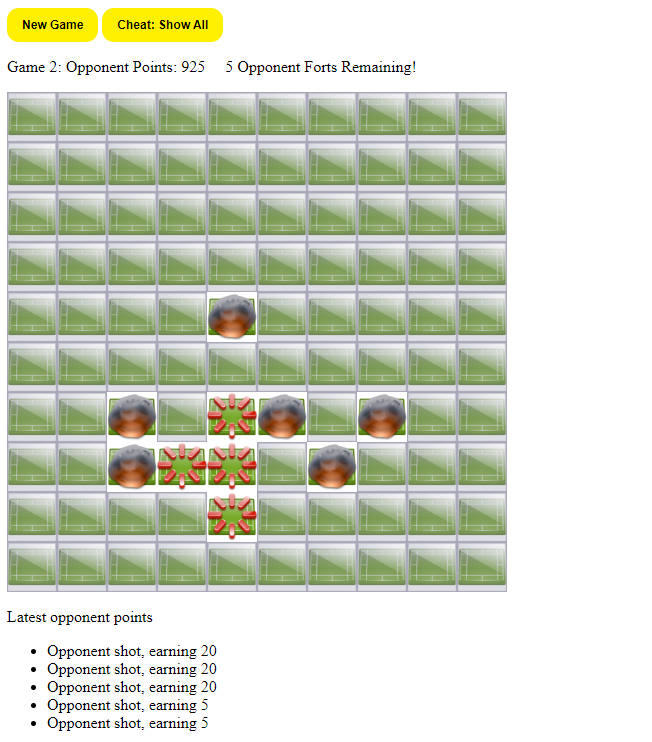

# Blanket Fort Game
A REST API for a Blanket Fort Game developed in Java Spring Boot

>Live demo available [here](https://springboot-game-server-mch4m52ieq-uc.a.run.app/) :sparkles:



## Technologies used
* [](https://www.java.com/en/)
* [](https://spring.io/projects/spring-boot)
* [](https://www.docker.com/)
* [](https://cloud.google.com/)

### Local Installation
Open the project in intellij and run Application.main().

Then navigate to http://localhost:8080


### Containerization with Docker
>Latest stable version [springboot-game-server:v1.0.2]

Run the following commands at the root directory.
```
./gradlew build
docker build -t <username>/<imagenamge>:<tag> .
```